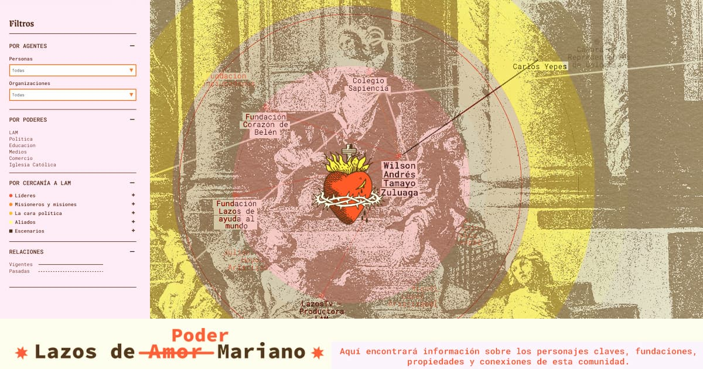

# Lazos de Poder Mariano

Este trabajo hace parte de la investigación 'Cruzada antiaborto en Colombia' sobre los grupos religiosos que en el país han buscado imponer restricciones al aborto tras el fallo de la Corte Constitucional que lo despenaliza hasta la semana 24.

Esta visualización muestra las redes de poder de uno de esos grupos, _Lazos de Amor Mariano_, una organización católica radical que en 2022 alcanzó escaños en el Congreso con los que busca restringir varios derechos sexuales y reproductivos en el país, además del aborto.

Aquí encontrará información sobre los personajes claves, fundaciones, propiedades y conexiones de esta comunidad.
